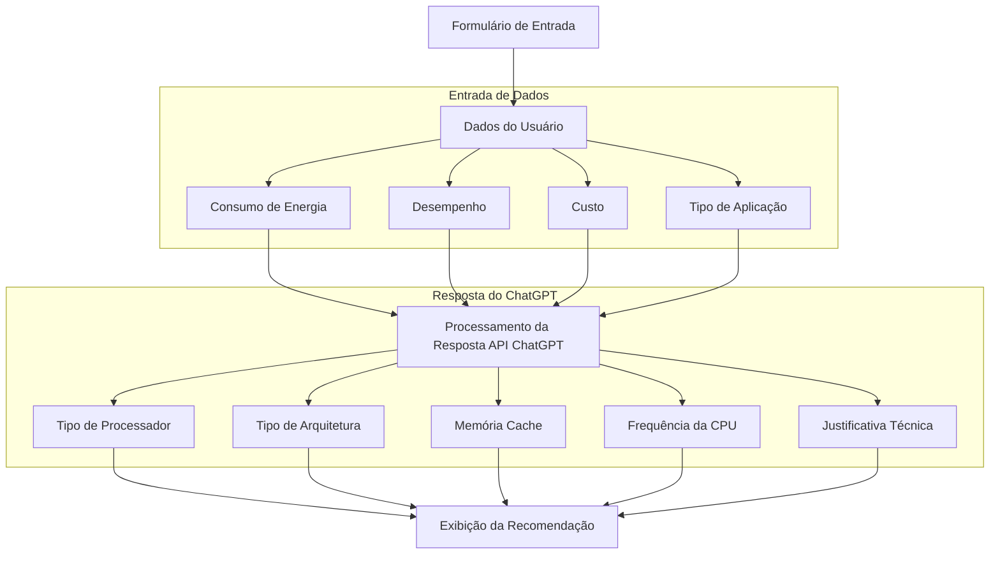

### TrabalhoFinalAC

- Fluxo de Integração: Formulário com ChatGPT API
- Diagrama do fluxo de dados entre o formulário e a API do ChatGPT para recomendação de processador:

- O diagrama mostra o fluxo completo desde a entrada de dados pelo usuário até a exibição da recomendação final, passando pelo processamento da API do ChatGPT.
